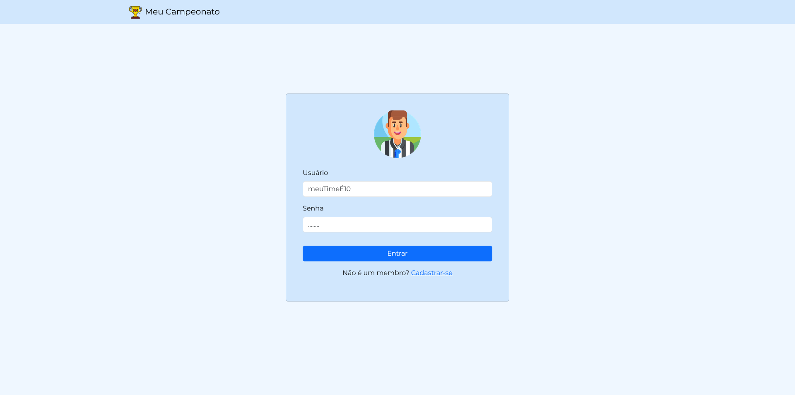
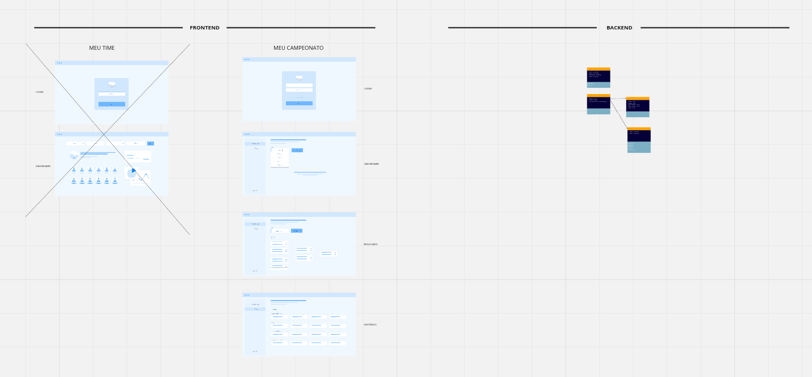

# Teste Trade Technology - Fullstack

Teste realizado para a vaga de fullstack em C# e Typescript(Front).

## 1. Como executar

API: Rode a API que rodará na url padrão [https://localhost:44369](https://localhost:44369). Ela irá usar o banco de dados PostgreSQL com usuário postgres e senha root, banco MyChampionship.

Frontend: Instale as dependências e rode `npm start` ou utilize seu gerênciador preferido.

## 2. Postman e Swagger

A API está com o Swagger ativado: [https://localhost:44369/swagger/index.html](https://localhost:44369/swagger/index.html).
Ou se preferir utilizar o [Postman](https://api.postman.com/collections/20873418-4cd55bab-03a4-4635-8f5b-8f7c235bbc3a?access_key=PMAT-01HG3P51ZC4TZHD4NMZXKBBG83)

## 3. Processo de estruturação do problema

Primeiro desenhei a solução para melhor visualização do problema todo. [Disponível aqui](https://miro.com/app/board/uXjVNLy0LZw=/?share_link_id=63801991410)

Segundo, iniciei o projeto do frontend para conseguir mais insights de features adicionais.

Infelizmente não consegui completar o teste todo por falta de tempo, listei aqui algumas features que precisariam ser implementadas:

- [API] Criação da simulação do torneio na API, com a execução do Python;
- [Front] Listagem do Histórico baseado na API
- [API] Hash de senha
- [Front e API] Rodar com Docker
- [Front e API] Testes
- [Front] Login com Gmail
