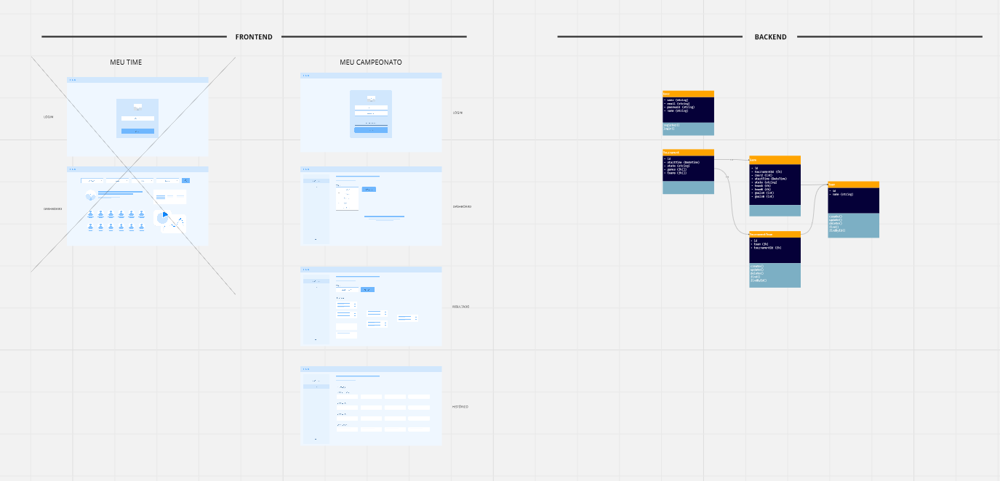

# Teste Trade Technology - Fullstack

Teste realizado para a vaga de fullstack em C#.

## 1. Como executar

## 2. Postman e Swagger

## 3. Processo de estruturação do problema

Primeiro desenhei a solução para melhor visualização do problema todo. [Disponível aqui](https://miro.com/app/board/uXjVNLy0LZw=/?share_link_id=63801991410)

Segundo, iniciei o projeto do frontend para conseguir mais insights de features adicionais.